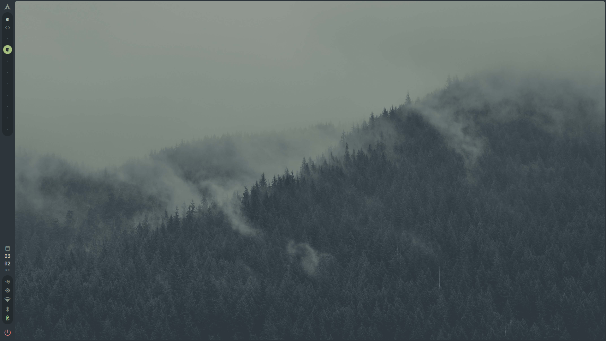
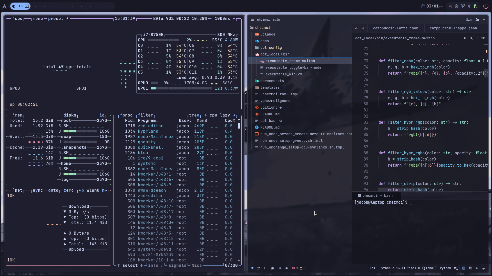

# Hyprland Dotfiles

[](LICENSE)

Chezmoi-managed dotfiles for my Hyprland desktop environment. A palette-driven theme system wires one JSON into every app — Hyprland, GTK, Ghostty, Zed, Obsidian, Quickshell — so switching from Everforest to Catppuccin is a single command with live animated transitions.

## Preview

| Everforest | Catppuccin Mocha |
|:---:|:---:|
|  |  |

## Features

- **Window Manager**: Hyprland
- **Desktop Shell**: Quickshell (bar, launcher, notifications, lock screen, wallpaper picker — uses hyprlock's PAM config for authentication; hyprlock configured as fallback)
- **Terminal**: Ghostty
- **Editor**: Zed with hand-crafted themes per palette
- **File Manager**: Yazi (terminal, themed), pane-fm (GUI, themed)
- **System Monitor**: btop
- **Theme System**: Palette-based runtime theme switching across all apps
- **GTK Theming**: libadwaita color overrides for GTK3/GTK4 apps
- **Login Manager**: greetd + tuigreet
- **Boot Theming**: GRUB bootloader theme

## Getting Started

```bash
# 1. Initialize and apply dotfiles
chezmoi init --apply https://github.com/jakeb-grant/dotfiles.git

# 2. Restart your shell (or log out and back in)
exec bash

# 3. Apply a theme
theme-switch everforest
```

## Installation

### Quick Start

```bash
chezmoi init --apply https://github.com/jakeb-grant/dotfiles.git
```

### Safe Installation (Preserving Existing Configs)

Chezmoi will overwrite managed files. To preview changes first:

```bash
# Clone without applying
chezmoi init https://github.com/jakeb-grant/dotfiles.git

# Preview what would change
chezmoi diff

# Apply when ready
chezmoi apply
```

### Dependencies

These dotfiles are designed for [arch-quickstart](https://github.com/jakeb-grant/arch-quickstart), which provides a custom Arch ISO with all required packages pre-installed.

## What's Included

```
dot_config/
├── hypr/               # Hyprland window manager + hypridle + hyprlock (fallback)
├── quickshell/         # Desktop shell
│   └── modules/
│       ├── bar/            # Status bar (sidebar + topbar modes)
│       ├── drawers/        # Slide-out panels
│       ├── launcher/       # App launcher
│       ├── lockscreen/     # Lock screen (uses hyprlock PAM)
│       ├── notifications/  # Notification center
│       └── wallpaper/      # Wallpaper picker
├── ghostty/            # Terminal emulator
├── zed/                # Zed editor settings + hand-crafted themes
├── yazi/               # Yazi file manager theme
├── pane-fm/            # pane-fm file manager config + themes
├── btop/               # System monitor theme
├── phylax/             # Desktop widget styling
├── gtk-3.0/            # GTK3 color overrides
├── gtk-4.0/            # GTK4/libadwaita color overrides
├── grub/               # GRUB bootloader theme
├── sddm-theme/         # SDDM login theme (legacy, replaced by greetd)
├── windows-vm/         # Windows VM (docker-compose)
├── palette/            # Theme palette definitions (JSON)
└── wallpapers/         # Flat image pool + wallpapers.json config
knowledge/
└── dot_obsidian/           # Obsidian vault theme (~/knowledge/ must be the vault)
    ├── appearance.json     # Selects "Palette" theme
    └── themes/Palette/     # Theme CSS template + manifest
dot_local/bin/
├── theme-switch        # Theme switching utility
├── toggle-bar-mode     # Switch between sidebar and topbar layouts
├── wallpaper-split     # Split wide/panoramic images into per-monitor sets
├── wallpaper-upscale   # AI upscale images using EDSR 4x (CPU)
└── win-vm              # Windows VM management
```

## Theme System

Palette JSONs are the single source of truth. `theme-switch` applies them across all apps via three methods:

**Templated apps** (chezmoi templates reading the active palette):
```
Palette JSON              active.json                     Chezmoi Template            Final Config
(everforest.json) --->   written by theme-switch --->   (style.css.tmpl reads  ---> (style.css)
                                                          active.json) chezmoi apply
```
Used by: GTK3/4, Phylax, Yazi, Zed settings, Obsidian, hyprlock.

**Direct-write apps** (built-in theme selection or generated config):
```
Palette JSON              theme-switch                    Final Config
(everforest.json) --->   reads _ghostty_theme   --->    writes theme = Everforest Dark Hard
```
Used by: Ghostty (`_ghostty_theme`), btop (`_btop_theme`), pane-fm (`_pane_fm_theme`). (Zed theme selection is templated via `_zed_theme_dark`/`_zed_theme_light` meta keys; theme-switch only syncs the rendered file in place so Zed's hot reload survives.)

**Lua-required (Hyprland)**:
```
Palette JSON              theme-switch                    palette.lua            hyprland.lua
(everforest.json) --->   generates palette.lua --->     local p = require()  ---> p.surface0_rgba(0.93)
```
`hyprland.lua` requires `palette.lua` and reads role-helpers like `p.surface0_rgba(0.93)`. Lets `hyprctl reload` pick up new colors without re-rendering a chezmoi template.

**Quickshell** watches `active.json` directly for live animated transitions — no restart needed.

### How It Works

1. **Palette files** (`dot_config/palette/*.json`) define color roles using Catppuccin-style naming
2. **`theme-switch`** writes `active.json` (palette + derived `_accent*` keys), generates `palette.lua`, updates direct-write apps
3. **`chezmoi apply`** renders themed `.tmpl` configs from `active.json` and machine-specific variables (GPU config, hostname)
4. **Quickshell** detects `active.json` change and animates to new colors instantly

### Available Palettes

| Palette | Variant |
|---------|---------|
| Catppuccin Mocha | dark |
| Catppuccin Frappé | dark |
| Catppuccin Macchiato | dark |
| Catppuccin Latte | light |
| Rosé Pine | dark |
| Rosé Pine Moon | dark |
| Rosé Pine Dawn | light |
| Everforest | dark |
| Everforest Light | light |
| Nord | dark |

### Template Syntax

Theme colors (chezmoi Go templates, rendered by `chezmoi apply`):
```
{{- $p := include "dot_config/palette/active.json" | fromJson -}}
{{ $p.crust }}                              # Direct color value: #11111b
{{ template "rgba" (list $p.crust 0.95) }}  # CSS rgba with opacity
{{ template "hypr_rgba" (list $p.surface0 0.93) }}  # Hyprland format (hyprlock)
```

Lua-side colors in `hyprland.lua.tmpl` (via `palette.lua`):
```lua
local p = require("palette")
p.surface0_rgba(0.93)                 -- "rgba(313244ed)"
p.crust_rgb()                         -- "rgb(11111b)"
```

Chezmoi variables (Go templates, processed by `chezmoi apply`):
```
{{ .graphics }}                       # Machine-specific data
{{ if eq .graphics "nvidia" }}...{{ end }}
```

### Color Helpers (`.chezmoitemplates/`)

| Helper | Output Example |
|--------|----------------|
| `rgba` (color, opacity) | `rgba(61, 219, 217, 0.90)` |
| `rgb_values` (color) | `61, 219, 217` |
| `hypr_rgb` (color) | `rgb(3ddbd9)` |
| `hypr_rgba` (color, opacity) | `rgba(3ddbd9e5)` |

### Usage

```bash
# Switch theme (updates active.json, applies chezmoi, reloads apps)
theme-switch everforest
```

## Wallpaper System

Wallpapers live in a flat directory (`~/.config/wallpapers/`) with a `wallpapers.json` config that defines singles and sets with palette assignments.

```json
{
  "wallpapers": [
    { "file": "forest.jpg", "palettes": ["everforest*"] },
    { "file": "sunset.jpg", "palettes": ["*"] }
  ],
  "sets": [
    {
      "name": "Cyberpunk",
      "images": ["cyberpunk-1.png", "cyberpunk-2.png", "cyberpunk-3.png"],
      "palettes": ["catppuccin*"]
    }
  ]
}
```

- **Singles** apply one image across all monitors
- **Sets** assign images to monitors left-to-right, cycling with modulo if there are fewer images than monitors
- **Palettes** supports exact names (`catppuccin-mocha`), globs (`catppuccin*`), or `*` for all themes
- The current wallpaper persists across reboots via `~/.config/wallpapers/.current`
- Quickshell watches `wallpapers.json` for live updates via `FileView`

### Wallpaper Tools

```bash
# Split panoramic images into per-monitor sets (default: 3 monitors, jpg)
wallpaper-split ~/Downloads/panoramas/ --palettes "catppuccin*,rose-pine*"

# AI upscale images using EDSR 4x (CPU-only, tiled processing)
wallpaper-upscale ~/Downloads/lowres/ -o ~/Downloads/upscaled/
```

## Machine-Specific Configuration

On first run, chezmoi prompts for machine-specific settings stored in `~/.config/chezmoi/chezmoi.toml`:

| Variable | Options | Description |
|----------|---------|-------------|
| `graphics` | `amd`, `intel`, `prime`, `nvidia` | GPU driver configuration |
| `igpu_pci` | PCI ID (auto-detected) | Integrated GPU — only prompted for `prime` |
| `dgpu_pci` | PCI ID (auto-detected) | Discrete GPU — only prompted for `prime` |

To change settings:
```bash
chezmoi edit-config
chezmoi apply
```

## License

MIT
